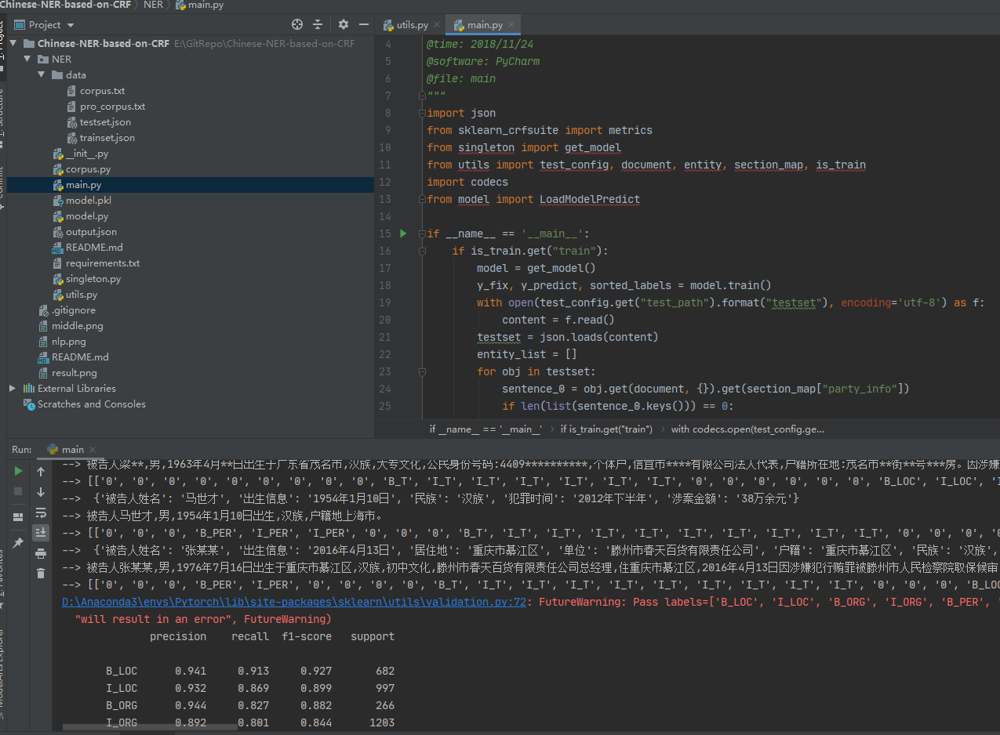
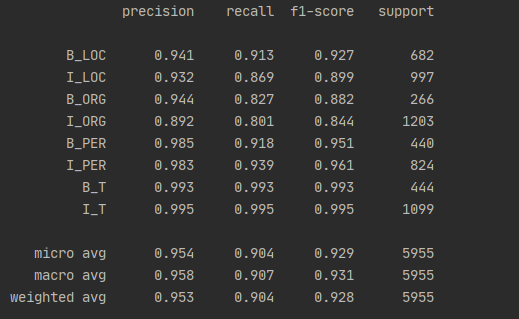

# 基于条件随机场(CRF)对中文案件语料进行命名实体识别(NER)

[](https://www.python.org/) []()


## 文件组织

 - **corpus.py** 
    语料类
    
 - **model.py**
    模型类
    
 - **utils.py**
    工具函数、映射、配置
   
 - **data**
    语料
    
 - **requirements.txt**
    依赖
    
 
## 运行
    ```
        pip install -i https://pypi.tuna.tsinghua.edu.cn/simple -r requirements.txt
    ```
    即可


## 效果

中间结果




预测结果

